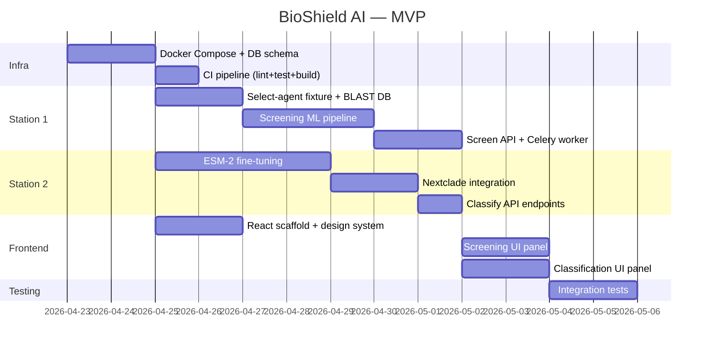

# BioShield AI — Execution Plan

## Architecture Overview

```
┌─────────────────────────────────────────────────────────────────────┐
│                     React + Plotly Dashboard                        │
├──────────┬──────────┬──────────┬──────────┬─────────────────────────┤
│ Station 1│ Station 2│ Station 3│ Station 4│       Station 5         │
│ Sequence │ Pathogen │ Environ. │  LLM     │   Command Center        │
│ Screening│ Classif. │ Surveill.│ Guardrail│   (Unified Dashboard)   │
├──────────┴──────────┴──────────┴──────────┴─────────────────────────┤
│              FastAPI Gateway  (async, Pydantic v2)                  │
├──────────┬──────────┬──────────┬──────────┬─────────────────────────┤
│ SecureDNA│ ESM-2    │ Freyja   │ NeMo     │  Grafana / Prometheus   │
│ BLAST+   │ XGBoost  │ Nextclade│ Guardrail│  PostGIS / TimescaleDB  │
├──────────┴──────────┴──────────┴──────────┴─────────────────────────┤
│  Redis (Celery)  │  PostgreSQL 16  │  MinIO (S3)  │  MLflow        │
├──────────────────┴─────────────────┴──────────────┴────────────────┤
│           Docker Compose (dev) → Kubernetes (prod)                  │
└─────────────────────────────────────────────────────────────────────┘
```

---

## Station 1 — Nucleotide Sequence Screening Engine

### 1.1 Data Layer

| # | Task | Type | Scope | Detail |
|---|------|------|-------|--------|
| 1.1.1 | Ingest NCBI Pathogen Detection reference DB (`datasets` CLI) | Automated | [MVP] | Cron job: `ncbi-datasets download genome taxon 2 --assembly-level complete` → parse with `BioPython==1.84` into PostgreSQL `sequences` table |
| 1.1.2 | Integrate SecureDNA Screening API | Automated | [MVP] | REST client via `httpx==0.27` calling `api.securedna.org/v1/screen`; store verdicts in `screen_results` table |
| 1.1.3 | Build local BLAST+ index from NCBI select-agent list | Automated | [MVP] | `blast==2.16.0+` `makeblastdb -dbtype nucl`; refresh weekly via `APScheduler==3.10` |
| 1.1.4 | Curate select-agent & Australia Group pathogen list | Manual | [MVP] | Biosecurity SME maps APHIS/CDC select-agent registry → NCBI taxids; one-time JSON fixture `select_agents.json` |

### 1.2 ML Pipeline

| # | Task | Type | Scope | Detail |
|---|------|------|-------|--------|
| 1.2.1 | Sequence risk scorer: k-mer + TF-IDF featurization | Automated | [MVP] | `scikit-learn==1.5` `TfidfVectorizer` on 6-mer frequencies; train `XGBClassifier` (binary: flagged/clean) tracked in `MLflow==2.16` |
| 1.2.2 | BLAST alignment fallback for novel sequences | Automated | [MVP] | `blastn -task megablast -evalue 1e-10 -outfmt 6`; parse with `BioPython.SearchIO`; flag if >80% identity to select-agent |
| 1.2.3 | Calibrate risk thresholds per pathogen category | Manual | [PROD] | Biosecurity expert reviews ROC curves (generated by `plotly==5.24`) and sets per-category accept/reject thresholds |

### 1.3 API Endpoints

| # | Task | Type | Scope | Detail |
|---|------|------|-------|--------|
| 1.3.1 | `POST /v1/screen/sequence` — async screening | Automated | [MVP] | FastAPI route → `Celery==5.4` task → Redis 7 broker; returns `task_id`; poll via `GET /v1/screen/{task_id}` |
| 1.3.2 | `POST /v1/screen/batch` — multi-FASTA upload | Automated | [PROD] | `python-multipart==0.0.12` file upload; fan-out to Celery group; aggregate results |
| 1.3.3 | Input validation (Pydantic v2 schemas) | Automated | [MVP] | Validate IUPAC alphabet, max length 50 Mbp, reject non-nucleotide chars |

---

## Station 2 — Pathogen Classification & Variant Typing

### 2.1 Data Layer

| # | Task | Type | Scope | Detail |
|---|------|------|-------|--------|
| 2.1.1 | Download GISAID EpiCoV metadata (authorized access) | Manual | [MVP] | Requires GISAID DAA sign-off; download via `gisaidr` R package or manual portal export → ingest with `pandas==2.2` |
| 2.1.2 | Build Nextclade reference dataset cache | Automated | [MVP] | `nextclade dataset get --name sars-cov-2 --output-dir data/nextclade/`; cron weekly |
| 2.1.3 | Ingest UniProt viral proteome subset | Automated | [PROD] | `httpx` GET `rest.uniprot.org/uniprotkb/stream?query=taxonomy_id:10239&format=fasta` → MinIO S3 bucket |

### 2.2 ML Pipeline

| # | Task | Type | Scope | Detail |
|---|------|------|-------|--------|
| 2.2.1 | Fine-tune ESM-2 (`esm2_t12_35M_UR50D`) for pathogen-family classification | Automated | [MVP] | `fair-esm==2.0.0` + `PyTorch==2.4`; 5-fold stratified CV; classify into 12 pathogen families; log to MLflow |
| 2.2.2 | Variant caller: Nextclade CLI integration | Automated | [MVP] | `subprocess.run(["nextclade", "run", ...])` → parse JSON output; store clade + mutation list in PostgreSQL |
| 2.2.3 | Ensemble: ESM-2 embeddings → `LightGBM==4.5` meta-learner | Automated | [PROD] | Extract CLS-token embeddings (480-d) → concatenate with Nextclade mutation features → `lgb.LGBMClassifier` stacking |
| 2.2.4 | Validate classifier on held-out BSL-3/4 pathogen panel | Manual | [PROD] | Lab-validated isolate sequences provided by collaborating BSL-3 facility; biosafety committee approval required |

### 2.3 API Endpoints

| # | Task | Type | Scope | Detail |
|---|------|------|-------|--------|
| 2.3.1 | `POST /v1/classify/pathogen` — single sequence | Automated | [MVP] | Accept FASTA string; return top-3 predictions + confidence; latency target <2s on GPU (NVIDIA T4) |
| 2.3.2 | `POST /v1/classify/variant` — lineage assignment | Automated | [MVP] | Nextclade-backed; return Pango lineage + WHO label + mutation list |
| 2.3.3 | `GET /v1/classify/model-card` — model metadata | Automated | [PROD] | Auto-generated from MLflow run metadata; includes training data hash, metric summary, bias audit |

---

## Station 3 — Environmental & Wastewater Surveillance

### 3.1 Data Layer

| # | Task | Type | Scope | Detail |
|---|------|------|-------|--------|
| 3.1.1 | Ingest NWSS (National Wastewater Surveillance System) CSV feeds | Automated | [PROD] | `httpx` polling CDC NWSS data API daily; parse with `polars==1.8`; store in TimescaleDB hypertable `wastewater_signals` |
| 3.1.2 | Ingest ProMED-mail alerts via RSS | Automated | [PROD] | `feedparser==6.0` on `promedmail.org/rss`; NER extraction with `spaCy==3.8` (`en_core_web_trf`) for location + pathogen entities |
| 3.1.3 | Ingest WHO Disease Outbreak News | Automated | [PROD] | Scrape `who.int/emergencies/disease-outbreak-news` with `httpx` + `selectolax==0.3`; store structured alerts |
| 3.1.4 | Validate wastewater sampling site geolocation accuracy | Manual | [PROD] | Public health partner confirms lat/lon of collection sites against municipal records |

### 3.2 ML Pipeline

| # | Task | Type | Scope | Detail |
|---|------|------|-------|--------|
| 3.2.1 | Wastewater variant deconvolution via Freyja | Automated | [PROD] | `freyja==1.5` `demix` + `boot` on aligned BAMs; output lineage proportions with 95% CI |
| 3.2.2 | Anomaly detection on wastewater viral load time-series | Automated | [PROD] | `statsmodels==0.14` STL decomposition + `PyOD==2.0` Isolation Forest on residuals; alert if z-score > 3 |
| 3.2.3 | Geospatial risk heatmap computation | Automated | [PROD] | `geopandas==1.0` + `h3-py==4.1` hexagonal binning of outbreak signals; kernel density estimation via `scipy.stats.gaussian_kde` |
| 3.2.4 | Epi-curve forecasting (7-day horizon) | Automated | [PROD] | `NeuralProphet==0.9` trained per-site; fallback to `statsmodels` ARIMA if <60 data points |

### 3.3 API Endpoints

| # | Task | Type | Scope | Detail |
|---|------|------|-------|--------|
| 3.3.1 | `GET /v1/surveillance/alerts` — real-time alert feed | Automated | [PROD] | Server-Sent Events via `sse-starlette==2.1`; filterable by pathogen, region, severity |
| 3.3.2 | `GET /v1/surveillance/heatmap?bbox=...` — GeoJSON risk layer | Automated | [PROD] | Returns H3-binned GeoJSON; cache in Redis with 1h TTL |
| 3.3.3 | `GET /v1/surveillance/forecast/{site_id}` — trend prediction | Automated | [PROD] | Returns 7-day forecast + 90% prediction interval as JSON array |

---

## Station 4 — LLM Biosafety Guardrails

### 4.1 Core Guardrail Stack

| # | Task | Type | Scope | Detail |
|---|------|------|-------|--------|
| 4.1.1 | Deploy NVIDIA NeMo Guardrails (`nemoguardrails==0.11`) | Automated | [PROD] | Colang 2.0 policy files defining `define bot refuse biosecurity` flows; intercept all `/v1/chat/*` routes |
| 4.1.2 | Build dual-use prompt classifier | Automated | [PROD] | Fine-tune `sentence-transformers/all-MiniLM-L6-v2` on curated dual-use prompt corpus (~5k examples); serve as NeMo input rail |
| 4.1.3 | Output toxicity filter | Automated | [PROD] | `detoxify==0.5` (`unitary/toxic-bert`) on all LLM responses; block if `severe_toxicity > 0.7` |
| 4.1.4 | Curate dual-use prompt training corpus | Manual | [PROD] | Biosecurity + AI safety experts label 5,000 prompts as benign/suspicious/malicious; IRB-equivalent review |
| 4.1.5 | Red-team adversarial audit of guardrails | Manual | [PROD] | External red-team (e.g., RAND biosecurity) performs jailbreak testing; results feed back into Colang policy updates |

### 4.2 Integration

| # | Task | Type | Scope | Detail |
|---|------|------|-------|--------|
| 4.2.1 | Wrap guardrails as FastAPI middleware | Automated | [PROD] | `Starlette` middleware inspecting request/response bodies on `/v1/chat/*` and `/v1/screen/*` explanation endpoints |
| 4.2.2 | Audit log: every blocked prompt → PostgreSQL `guardrail_audit` table | Automated | [PROD] | Columns: `timestamp, user_id, prompt_hash, risk_score, action_taken, policy_triggered` |
| 4.2.3 | Canary token injection for data-exfiltration detection | Automated | [PROD] | Embed UUID canary in system prompts; `rebuff==0.2` monitors outputs for leaked tokens |

---

## Station 5 — Unified Command Center Dashboard

### 5.1 Frontend

| # | Task | Type | Scope | Detail |
|---|------|------|-------|--------|
| 5.1.1 | React 18 + Vite 6 project scaffold | Automated | [MVP] | `npx -y create-vite@latest ./ --template react-ts`; install `plotly.js==2.35`, `react-plotly.js==2.6`, `react-map-gl==7.1` (Mapbox GL) |
| 5.1.2 | Screening results panel (Station 1 UI) | Automated | [MVP] | Upload FASTA → show risk verdict, BLAST hits table, confidence gauge (`plotly.Indicator`) |
| 5.1.3 | Pathogen classification panel (Station 2 UI) | Automated | [MVP] | Paste sequence → show top-3 predictions bar chart, mutation heatmap, lineage tree |
| 5.1.4 | Surveillance map (Station 3 UI) | Automated | [PROD] | `react-map-gl` + Mapbox `heatmap` layer; time-slider for historical playback; epi-curve subplot via Plotly |
| 5.1.5 | Guardrail audit dashboard (Station 4 UI) | Automated | [PROD] | Table of blocked prompts; risk-score histogram; daily block-rate trend line |
| 5.1.6 | System health sidebar | Automated | [PROD] | Embed Grafana panels via `<iframe>` or pull from Prometheus `/api/v1/query` directly |

### 5.2 UX & Design

| # | Task | Type | Scope | Detail |
|---|------|------|-------|--------|
| 5.2.1 | Design system: CSS custom properties, dark mode, Inter font | Automated | [MVP] | Root variables for color palette (biohazard amber `#F59E0B`, biosafe teal `#14B8A6`, dark bg `#0F172A`) |
| 5.2.2 | Responsive layout (mobile-first grid) | Automated | [MVP] | CSS Grid + `clamp()` typography; breakpoints at 640/1024/1440px |
| 5.2.3 | Micro-animations: risk-level pulse, loading skeleton | Automated | [MVP] | CSS `@keyframes` pulse on high-risk cards; skeleton via `react-loading-skeleton==3.5` |

---

## Cross-Cutting: Infrastructure & DevOps

### 6.1 Containerization

| # | Task | Type | Scope | Detail |
|---|------|------|-------|--------|
| 6.1.1 | Multi-stage Dockerfile (API) | Automated | [MVP] | Base: `python:3.11-slim`; stage 1 builds wheels; stage 2 copies only runtime deps; final image <800MB |
| 6.1.2 | `docker-compose.yml` — full local stack | Automated | [MVP] | Services: `api`, `worker` (Celery), `redis:7-alpine`, `postgres:16-alpine`, `minio`, `mlflow` |
| 6.1.3 | Frontend Dockerfile (Nginx) | Automated | [MVP] | Build: `node:20-alpine` → `npm run build`; Serve: `nginx:1.27-alpine` with gzip + SPA fallback |

### 6.2 CI/CD

| # | Task | Type | Scope | Detail |
|---|------|------|-------|--------|
| 6.2.1 | GitHub Actions: lint + test + build | Automated | [MVP] | `ruff==0.7` lint, `pytest==8.3` with `pytest-cov`, build Docker images on push to `main` |
| 6.2.2 | GitHub Actions: model regression gate | Automated | [PROD] | On PR, run `pytest tests/ml/` → compare metrics against MLflow baseline; block merge if F1 drops >2% |
| 6.2.3 | Helm chart for Kubernetes deployment | Automated | [PROD] | `helm create bioshield`; values for replica count, GPU node selector, resource limits, secrets via `external-secrets` |

### 6.3 Observability

| # | Task | Type | Scope | Detail |
|---|------|------|-------|--------|
| 6.3.1 | Structured logging: `structlog==24.4` | Automated | [MVP] | JSON logs with `request_id`, `user_id`, `latency_ms`; ship to stdout for Docker log driver |
| 6.3.2 | Prometheus metrics endpoint | Automated | [PROD] | `prometheus-fastapi-instrumentator==7.0`; custom counters: `sequences_screened_total`, `threats_detected_total` |
| 6.3.3 | Grafana dashboards (JSON provisioning) | Automated | [PROD] | Pre-built dashboards: API latency p50/p95/p99, Celery queue depth, model inference time, threat detection rate |

### 6.4 Security & Compliance

| # | Task | Type | Scope | Detail |
|---|------|------|-------|--------|
| 6.4.1 | JWT auth via `python-jose==3.3` + OAuth2 password flow | Automated | [MVP] | FastAPI `Depends(get_current_user)`; roles: `analyst`, `admin`, `auditor` |
| 6.4.2 | Rate limiting: `slowapi==0.1.9` | Automated | [MVP] | 100 req/min per API key on screening endpoints; 10 req/min on batch endpoints |
| 6.4.3 | SBOM generation: `syft==1.15` | Automated | [PROD] | Generate CycloneDX SBOM on each Docker build; store in MinIO |
| 6.4.4 | Regulatory compliance review (BSAT, EAR) | Manual | [PROD] | Legal counsel reviews export-control implications of pathogen DB + model weights distribution |
| 6.4.5 | Pen-test of API surface | Manual | [PROD] | Contracted security firm runs OWASP API Top-10 assessment against staging environment |

---

## Cross-Cutting: Data & ML Operations

### 7.1 Experiment Tracking & Model Registry

| # | Task | Type | Scope | Detail |
|---|------|------|-------|--------|
| 7.1.1 | MLflow Tracking Server (Docker service) | Automated | [MVP] | `mlflow server --backend-store-uri postgresql://... --default-artifact-root s3://mlflow/` via MinIO |
| 7.1.2 | Model promotion pipeline: Staging → Production | Automated | [PROD] | MLflow Model Registry webhook → GitHub Actions → rebuild Docker image with new model artifact |
| 7.1.3 | Data versioning with DVC | Automated | [PROD] | `dvc==3.56` tracking `data/` directory; remote storage on MinIO; `dvc repro` for pipeline DAG |

### 7.2 Testing

| # | Task | Type | Scope | Detail |
|---|------|------|-------|--------|
| 7.2.1 | Unit tests: API routes + Pydantic schemas | Automated | [MVP] | `pytest` + `httpx.AsyncClient`; 80% coverage target |
| 7.2.2 | Integration tests: full screening pipeline | Automated | [MVP] | `testcontainers-python==4.8` spins up Postgres + Redis; submit known-benign & known-threat sequences |
| 7.2.3 | ML regression tests | Automated | [PROD] | `pytest` fixtures load frozen test set; assert F1 ≥ baseline stored in `tests/baselines.json` |
| 7.2.4 | Load test: screening endpoint | Automated | [PROD] | `locust==2.31` simulating 500 concurrent users; pass criteria: p95 < 3s, error rate < 0.1% |

---

## Directory Structure (Target)

```
BioShield-AI/
├── backend/
│   ├── app/
│   │   ├── main.py              # FastAPI app factory
│   │   ├── config.py            # pydantic-settings
│   │   ├── routers/
│   │   │   ├── screen.py        # Station 1 endpoints
│   │   │   ├── classify.py      # Station 2 endpoints
│   │   │   ├── surveillance.py  # Station 3 endpoints
│   │   │   └── chat.py          # Station 4 guarded chat
│   │   ├── models/              # SQLAlchemy ORM models
│   │   ├── schemas/             # Pydantic v2 schemas
│   │   ├── services/            # Business logic
│   │   │   ├── blast_service.py
│   │   │   ├── esm_service.py
│   │   │   ├── freyja_service.py
│   │   │   └── guardrail_service.py
│   │   ├── ml/                  # Training scripts
│   │   │   ├── train_screener.py
│   │   │   ├── train_classifier.py
│   │   │   └── train_anomaly.py
│   │   ├── tasks/               # Celery tasks
│   │   └── middleware/          # Auth, guardrails, logging
│   ├── tests/
│   ├── Dockerfile
│   └── pyproject.toml
├── frontend/
│   ├── src/
│   │   ├── components/
│   │   ├── pages/
│   │   ├── hooks/
│   │   └── styles/
│   ├── Dockerfile
│   └── package.json
├── infra/
│   ├── docker-compose.yml
│   ├── helm/
│   └── github-actions/
├── data/
│   ├── select_agents.json
│   └── .dvc/
├── mlflow/
├── notebooks/                   # EDA & prototyping
└── docs/
```

---

## Execution Sequence

### Phase A — MVP (Stations 1–2) · Target: 2 weeks



### Phase B — Production (Stations 3–5) · Target: 6 weeks after MVP

> [!IMPORTANT]
> Phase B begins only after MVP demo validation and stakeholder sign-off.

1. Weeks 3–4: Station 3 data pipelines + anomaly detection + surveillance map UI
2. Weeks 5–6: Station 4 guardrail stack + red-team audit cycle
3. Weeks 7–8: Station 5 unified dashboard + Helm charts + load testing + pen-test

---

## Key Dependencies (pinned)

```toml
# pyproject.toml [project.dependencies] — MVP subset
python = ">=3.11,<3.13"
fastapi = ">=0.115"
uvicorn = { version = ">=0.32", extras = ["standard"] }
celery = { version = ">=5.4", extras = ["redis"] }
sqlalchemy = ">=2.0"
alembic = ">=1.14"
pydantic = ">=2.9"
pydantic-settings = ">=2.6"
biopython = ">=1.84"
httpx = ">=0.27"
fair-esm = ">=2.0.0"
torch = ">=2.4"
xgboost = ">=2.1"
scikit-learn = ">=1.5"
mlflow = ">=2.16"
structlog = ">=24.4"
python-jose = { version = ">=3.3", extras = ["cryptography"] }
slowapi = ">=0.1.9"
plotly = ">=5.24"
pandas = ">=2.2"
```

---

## Open Questions

> [!IMPORTANT]
> **Q1 — Scope confirmation:** Do you want the MVP to include a working ESM-2 model trained on a public dataset (e.g., UniProt viral subset), or should Station 2 MVP stub the classifier with a mock model and defer real training to PROD?

> [!IMPORTANT]
> **Q2 — GISAID access:** Do you already have a GISAID Data Access Agreement, or should the plan assume only publicly available NCBI GenBank data for both MVP and PROD?

> [!WARNING]
> **Q3 — GPU availability:** ESM-2 fine-tuning and inference require a CUDA-capable GPU (minimum 8 GB VRAM, recommended NVIDIA T4/A10). Confirm whether your dev environment has GPU access, or if training should target Google Colab / cloud VMs.

> [!NOTE]
> **Q4 — LLM integration scope (Station 4):** The guardrail station wraps an LLM chat interface. Which LLM backend should the plan target — self-hosted (e.g., `Ollama` + `Llama-3.1-8B`) or API-based (e.g., OpenAI `gpt-4o`, Anthropic `claude-sonnet-4`)?

## Verification Plan

### Automated Tests
- `pytest tests/ -v --cov=app --cov-report=term-missing` — target ≥80% coverage
- `testcontainers` integration tests: submit 10 known-threat + 10 known-benign FASTA sequences through full pipeline
- `locust` load test: 500 concurrent users on `/v1/screen/sequence` for 5 minutes

### Manual Verification
- Biosecurity SME reviews screening verdicts against APHIS select-agent list for false-positive/negative audit
- UI walkthrough recorded via browser tool demonstrating: upload → screen → classify → view result flow
